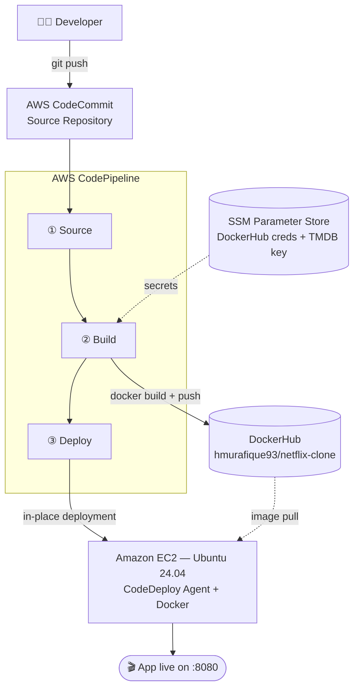

# 🚀 DevOps Project 013
# Netflix Clone — AWS Native CI/CD Pipeline


A fully automated, native AWS CI/CD pipeline that builds and deploys a Netflix Clone (React + TypeScript + Vite, TMDB API) to an EC2 instance — no GitHub Actions or Jenkins involved, pure AWS-managed services end to end.

## Architecture



## Tech Stack & Pinned Versions

| Component         | Version                           |
|-------------------|-----------------------------------|
| Frontend          | React + TypeScript + Vite 3.2.2   |
| Build base image  | node:20-alpine                    |
| Runtime image     | nginx:stable-alpine               |
| Docker (EC2)      | 29.1.3                            |
| CodeDeploy Agent  | 1.8.1-26                          |
| OS (EC2)          | Ubuntu Server 24.04 LTS           |

## Prerequisites

- AWS account with CodeCommit access (CodeCommit is no longer available to *new* AWS customers as of July 2024 — existing customers with prior access can still use it)
- DockerHub account
- TMDB v3 API key (themoviedb.org)

## Setup — Step by Step

### 1. IAM user + SSH key for CodeCommit
```bash
ssh-keygen -t rsa -b 4096 -f ~/.ssh/codecommit_rsa
```
Create IAM user with `AWSCodeCommitFullAccess`, upload the public key under Security Credentials → SSH keys, configure `~/.ssh/config` with `Host git-codecommit.*.amazonaws.com`.

### 2. Create CodeCommit repo & push source
```bash
git clone ssh://git-codecommit.us-east-1.amazonaws.com/v1/repos/netflix-clone-cicd
```

### 3. SSM Parameter Store (SecureString)
/myapp/docker-credentials/username

/myapp/docker-credentials/password

/myapp/api/key

### 4. CodeBuild project
- Source: CodeCommit, Privileged mode **ON** (required for Docker builds)
- Buildspec file name: `buildspec.yaml` (note: `.yaml`, not the console default `.yml`)
- IAM role needs an inline policy for `ssm:GetParameters` on `arn:aws:ssm:us-east-1:*:parameter/myapp/*`

### 5. CodeDeploy application + service role
- Compute platform: EC2/On-premises
- Service role uses managed policy `AWSCodeDeployRole`

### 6. EC2 deployment target
- IAM role: `AmazonEC2RoleforAWSCodeDeploy` + `AmazonS3ReadOnlyAccess`
- Security group: allow inbound TCP 8080 (app port)
- User data installs Docker + CodeDeploy agent (see Issues below for a required patch)

### 7. CodeDeploy deployment group
- Tag-based: `Name = <ec2-instance-name>`
- In-place deployment, no load balancer

### 8. CodePipeline
Source (CodeCommit) → Build (CodeBuild) → Deploy (CodeDeploy), CloudWatch Events for change detection.

## Issues Faced & Fixes

| Issue | Root Cause | Fix |
|---|---|---|
| `docker build` failed with `429 Too Many Requests` pulling `node:16.17.0-alpine` | `docker login` was placed *after* the build step in buildspec, so base image pulls were unauthenticated and hit DockerHub's anonymous rate limit | Moved `docker login` to `pre_build`, before `docker build` |
| `yarn install` failed: `node-releases@2.0.47` incompatible, needs Node >=18 | Dockerfile used `node:16.17.0-alpine`, too old for current dependencies | Upgraded Dockerfile to `node:20-alpine` |
| CodeDeploy agent installer exits: *"Ruby version 2.x, 3.x needs to be installed"* despite Ruby 3.3.8 present | Installer's hardcoded `supported_ruby_versions` array only lists up to `3.2`, doesn't recognize 3.3 (confirmed upstream bug, [aws-codedeploy-agent#353](https://github.com/aws/aws-codedeploy-agent/issues/353)) | Patched the downloaded `install` script: added `'3.3'` to the `supported_ruby_versions` array |
| `.deb` install fails: `Dependency is not satisfiable: ruby2.0|ruby2.1|...|ruby3.2` | Package metadata also hardcodes the same outdated Ruby dependency list | `sudo dpkg -i --force-depends codedeploy-agent_*.deb` to bypass the stale dependency check |
| CodeDeploy console "Create deployment" no longer offers a CodeCommit revision option | AWS UI change following CodeCommit's new-customer deprecation; only S3/GitHub revision sources shown now | Skipped manual console deployment — verified the pipeline end-to-end via CodePipeline instead |

## Cleanup (avoid ongoing AWS charges)

```bash
# Terminate EC2 instance (EC2 console)
# Delete CodePipeline (also delete the auto-created S3 artifact bucket)
# Delete CodeDeploy application (deletes deployment group with it)
# Delete CodeBuild project
# Delete CodeCommit repository
# Delete SSM parameters under /myapp/*
# Delete IAM roles: codecommit-netflix-user, EC2-CodeDeploy-Role, CodeDeployServiceRole, CodeBuild service role
# Optionally remove the pushed image from DockerHub
```

## Credits
AWS infrastructure designed and implemented end-to-end by Hafiz Muhammad Umar Rafique.
